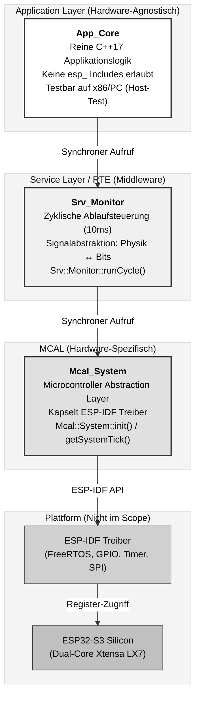
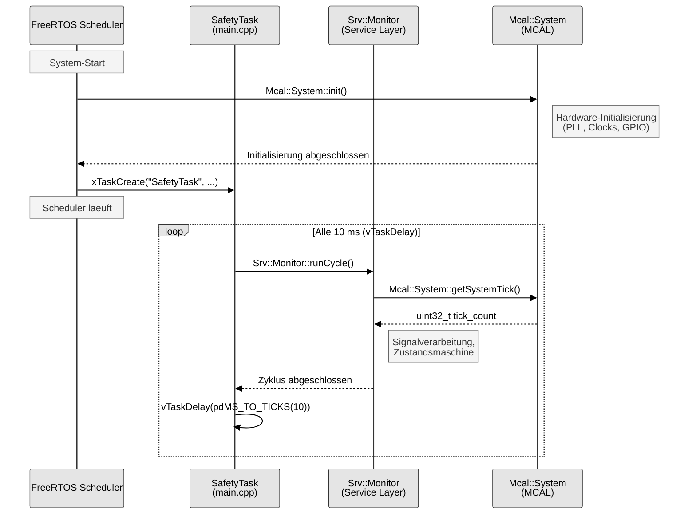
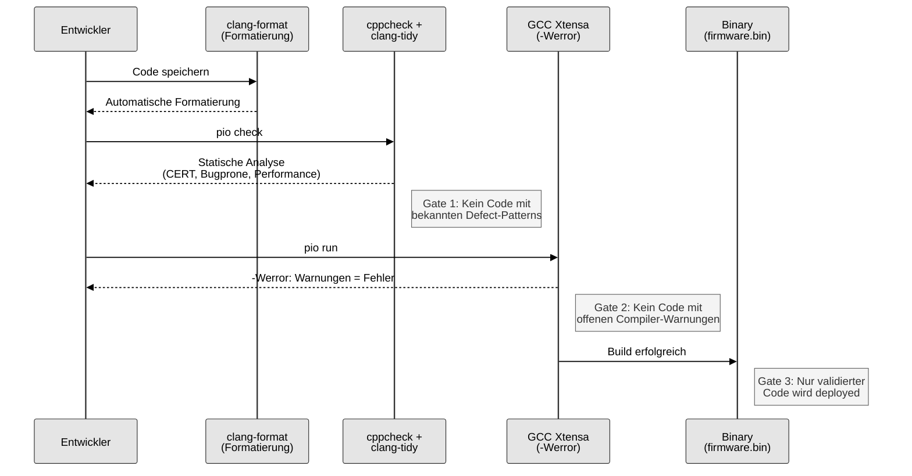

# 1. Systemdokumentation (Die Architektur)

| Metadaten          | Wert                                                           |
|--------------------|----------------------------------------------------------------|
| **Zielgruppe**     | Software-Architekten, Reviewer, Auditoren                      |
| **Zweck**          | Nachweis der statischen Struktur und der Design-Entscheidungen |
| **Klassifikation** | QM (Quality Managed) nach ISO 26262                            |
| **Plattform**      | Seeed Studio XIAO ESP32-S3 (Dual-Core Xtensa LX7)              |
| **Framework**      | ESP-IDF (FreeRTOS), kein Arduino                               |
| **Sprachen**       | C++17 (Application/Service), C11 (MCAL)                        |

---

## 1.1 Architekturschaubild (Schichtenmodell)

### Entwurfsprinzip

Die Software-Architektur folgt dem Prinzip der **strikten Schichtentrennung** (Layered Architecture), wie sie im Automotive-Bereich durch AUTOSAR und ISO 26262 gefordert wird. Jede Schicht kommuniziert ausschliesslich mit der direkt benachbarten Schicht. Horizontale Zugriffe oder Layer-Bypasses sind architektonisch verboten.

Die Umsetzung erfolgt physisch durch die Verzeichnisstruktur im `lib/`-Ordner. Jedes Modul besitzt eine eigene Bibliothek mit klar getrenntem `include/`- und `src/`-Verzeichnis:

```bash
lib/
  App_Core/              # <-- Schicht 1: Application Layer (Hardware-agnostisch)
    include/
      App_Core.hpp
    src/
      App_Core.cpp
  Mcal_System/           # <-- Schicht 3: MCAL (Hardware-spezifisch)
    include/
      Mcal_System.hpp
    src/
      Mcal_System.cpp
  Srv_Monitor/           # <-- Schicht 2: Service Layer / RTE
    include/
      Srv_Monitor.hpp
    src/
      Srv_Monitor.cpp
src/
  main.cpp               # <-- OS Entry Point (Startup Code)
```

Die Namenskonvention `Mcal_`, `Srv_`, `App_` codiert die Schichtzugehoerigkeit direkt im Modulnamen und macht Architekturverletzungen bereits am Include-Statement sichtbar.

### Schichtenmodell-Diagramm



### Schichtenbeschreibung

#### Schicht 1: Application Layer (`App_Core`)

| Eigenschaft        | Beschreibung                                          |
|--------------------|-------------------------------------------------------|
| **Praefix**        | `App_`                                                |
| **Sprache**        | C++17                                                 |
| **Hardware-Bezug** | Keiner. Keine `esp_`-Includes erlaubt.                |
| **Testbarkeit**    | Vollstaendig auf x86/PC kompilier- und testbar.       |
| **Verantwortung**  | Reine Applikationslogik, Zustandsmaschinen, Regelung. |

Die Application Layer enthaelt die gesamte Geschaeftslogik der Anwendung. Sie ist vollstaendig hardware-agnostisch und darf ausschliesslich ueber die Service-Schicht auf Hardware-Ressourcen zugreifen. Dies garantiert Portierbarkeit: Bei einem Plattformwechsel (z.B. ESP32 auf NXP S32K oder Infineon Aurix) bleibt die gesamte Applikationsschicht unveraendert und validiert.

#### Schicht 2: Service Layer / RTE (`Srv_Monitor`)

| Eigenschaft       | Beschreibung                                     |
|-------------------|--------------------------------------------------|
| **Praefix**       | `Srv_`                                           |
| **Sprache**       | C++17                                            |
| **Zykluszeit**    | 10 ms (Soft Real-Time, gesteuert durch FreeRTOS) |
| **Verantwortung** | Middleware, Signalabstraktion, Ablaufsteuerung.  |

Die Service-Schicht fungiert als **Runtime Environment (RTE)** analog zu AUTOSAR. Sie koordiniert den zyklischen Aufruf der Applikationslogik und abstrahiert Hardware-Signale in applikationsnahe Datentypen. Der zentrale Einstiegspunkt ist `Srv::Monitor::runCycle()`, der alle 10 ms durch den FreeRTOS-Task `SafetyTask` aufgerufen wird.

**Deklaration** (`lib/Srv_Monitor/include/Srv_Monitor.hpp`):

```cpp
namespace Srv {
class Monitor {
   public:
    static void runCycle();
};
}  // namespace Srv
```

**Implementierung** (`lib/Srv_Monitor/src/Srv_Monitor.cpp`):

```cpp
namespace Srv {

static uint32_t cycleCounter = 0;

void Monitor::runCycle() {
    auto tick = Mcal::System::getSystemTick();

    App::Core::run(std::optional<uint32_t>{tick});

    ++cycleCounter;
    if (cycleCounter >= App::Config::kHeartbeatIntervalCycles) {
        ESP_LOGI(TAG, "Heartbeat | tick=%lu | cycles=%lu",
                 static_cast<unsigned long>(tick),
                 static_cast<unsigned long>(cycleCounter));
        cycleCounter = 0;
    }
}

}  // namespace Srv
```

#### Schicht 3: MCAL (`Mcal_System`)

| Eigenschaft        | Beschreibung                                 |
|--------------------|----------------------------------------------|
| **Praefix**        | `Mcal_`                                      |
| **Sprache**        | C++17 / C11 (Hardware-nahe Teile)            |
| **Hardware-Bezug** | Direkter Zugriff auf ESP-IDF APIs.           |
| **Verantwortung**  | Hardware-Initialisierung, Treiber-Kapselung. |

Der MCAL (Microcontroller Abstraction Layer) ist die einzige Schicht, die Hardware-spezifischen Code enthaelt. Er kapselt saemtliche ESP-IDF-Aufrufe und stellt den hoeheren Schichten eine hardware-unabhaengige C++-Schnittstelle zur Verfuegung.

**Deklaration** (`lib/Mcal_System/include/Mcal_System.hpp`):

```cpp
namespace Mcal {
class System {
   public:
    static void init();
    static uint32_t getSystemTick();
};
}  // namespace Mcal
```

**Implementierung** (`lib/Mcal_System/src/Mcal_System.cpp`):

```cpp
namespace Mcal {
void System::init() {
    // Hardware-Initialisierung (PLL, Flash, Watchdog, etc.)
    ESP_LOGI(TAG, "Hardware Initialized (QM Level).");
}

uint32_t System::getSystemTick() {
    return static_cast<uint32_t>(xTaskGetTickCount());
}
}  // namespace Mcal
```

---

## 1.2 Schnittstellen-Definition

### Kommunikationsprinzip

Alle Schnittstellen im System folgen dem Prinzip **synchroner Funktionsaufrufe** mit strikter Aufrufrichtung:

```
Application Layer  --->  Service Layer  --->  MCAL
     (App_)                (Srv_)            (Mcal_)
```

Es gibt keine Callbacks, keine Events und keine asynchronen Mechanismen zwischen den Schichten. Die Ablaufsteuerung erfolgt ausschliesslich durch den zyklischen Task-Aufruf aus `main.cpp`.

### Aufrufsequenz (Runtime)



### Initialisierungssequenz

Der Systemstart in `app_main()` folgt einer deterministischen Reihenfolge:

```cpp
// Task-Konfiguration (deterministische Werte, keine Magic Numbers)
static constexpr uint32_t kSafetyTaskStackSize = 4096;
static constexpr UBaseType_t kSafetyTaskPriority = 5;

void app_main(void) {
    // 1. Hardware Initialisierung (MCAL)
    Mcal::System::init();

    // 2. Erstellen der OS Tasks
    xTaskCreate(run_safety_task, "SafetyTask", kSafetyTaskStackSize, nullptr,
                kSafetyTaskPriority, nullptr);

    // app_main endet hier, FreeRTOS Scheduler uebernimmt.
}
```

**Designentscheidung:** `app_main()` kehrt nach der Initialisierung zurueck. Ab diesem Zeitpunkt uebernimmt der FreeRTOS-Scheduler die vollstaendige Kontrolle ueber die Ausfuehrung. Dies entspricht dem Automotive-Paradigma, in dem die Startup-Sequenz strikt von der zyklischen Laufzeit getrennt ist.

### Datenfluss-Konzept: `std::optional` statt roher Pointer

Fuer die sichere Datenuebertragung zwischen Schichten wird `std::optional<T>` (C++17) als Rueckgabetyp empfohlen. Dies erzwingt eine explizite Plausibilitaetspruefung durch den Aufrufer und eliminiert Null-Pointer-Fehler zur Kompilierzeit.

**Konzeptbeispiel** (architektonisches Muster fuer Erweiterungen):

```cpp
// MCAL-Schicht: Hardware-Zugriff mit Fehlersignalisierung
namespace Mcal {
class Adc {
   public:
    static std::optional<float> readVoltage(uint8_t channel);
};
}  // namespace Mcal

// Service-Schicht: Plausibilitaetspruefung ist erzwungen
void Srv::Monitor::runCycle() {
    auto voltage = Mcal::Adc::readVoltage(0);

    if (voltage.has_value()) {
        // Gueltig: Wert an Applikation weiterleiten
        App::Core::processVoltage(voltage.value());
    } else {
        // Ungueltig: Fehlerbehandlung (Diagnostic Trouble Code)
        App::Core::reportSensorFault(SensorId::ADC_CH0);
    }
}
```

**Vorteile gegenueber C-Patterns:**

| C-Pattern (unsicher)                           | C++17-Pattern (sicher)                             |
|------------------------------------------------|----------------------------------------------------|
| `float* readVoltage()` (Null-Pointer moeglich) | `std::optional<float> readVoltage()` (Typensicher) |
| Rueckgabewert kann ignoriert werden            | Compiler warnt bei ungeprueftem Zugriff            |
| Manuelle Fehlercodes (`-1`, `0xFF`)            | Semantisch klar: `has_value()` / `value()`         |

### Schnittstellenmatrix

| Aufrufer          | Schnittstelle                   | Richtung | Rueckgabe                 | Beschreibung                       |
|-------------------|---------------------------------|----------|---------------------------|------------------------------------|
| `main.cpp`        | `Mcal::System::init()`          | Top-Down | `void`                    | Einmalige Hardware-Initialisierung |
| `main.cpp`        | `xTaskCreate(run_safety_task)`  | Top-Down | `BaseType_t`              | OS-Task-Erzeugung                  |
| `run_safety_task` | `Srv::Monitor::runCycle()`      | Top-Down | `void`                    | Zyklischer 10ms-Aufruf             |
| `Srv::Monitor`    | `Mcal::System::getSystemTick()` | Top-Down | `uint32_t`                | Aktuelle FreeRTOS Tick-Zaehlung    |
| `Srv::Monitor`    | `App::Core::run(std::optional<uint32_t>)` | Top-Down | `void`           | Zyklischer Applikationsaufruf      |
| `App::Core`       | `App::Core::getLastTick()`      | Intern   | `std::optional<uint32_t>` | Letzter verarbeiteter Tick         |

---

## 1.3 Design-Constraints (Safety-Regeln)

### Compiler-Konfiguration (`platformio.ini`)

Die Build-Konfiguration erzwingt Safety-Konformitaet auf Compiler-Ebene. Jedes Flag ist eine bewusste Design-Entscheidung:

```ini
[env:esp32s3-automotive]
platform = espressif32
board = seeed_xiao_esp32s3
framework = espidf

build_unflags = -std=gnu++11 -std=gnu++14 -std=c11
build_flags =
    -std=c11
    -std=c++17
    -DCORE_DEBUG_LEVEL=3
    -Wall -Wextra -Werror
    -Wno-unused-parameter
    -fstack-protector-strong
```

#### Flag-Analyse

| Flag                       | Kategorie       | Zweck und Begruendung                                                                                                             |
|----------------------------|-----------------|-----------------------------------------------------------------------------------------------------------------------------------|
| `-std=c++17`               | Sprachstandard  | Aktiviert `std::optional`, `constexpr if`, `[[nodiscard]]`, strukturierte Bindings.                                               |
| `-std=c11`                 | Sprachstandard  | C11 fuer MCAL-nahen Code. Ersetzt GNU-Erweiterungen (`gnu++11`, `gnu++14`) durch Standard-konformen Code.                         |
| `build_unflags`            | Hygiene         | Entfernt explizit die Default-Standards des ESP-IDF-Toolchains, um deterministische Kompilierung sicherzustellen.                 |
| `-Wall`                    | Warnungen       | Aktiviert alle gaengigen Compiler-Warnungen (implizite Konvertierungen, fehlende Returns, etc.).                                  |
| `-Wextra`                  | Warnungen       | Aktiviert zusaetzliche Warnungen (ungenutzte Parameter, Vorzeichenvergleiche, etc.).                                              |
| `-Werror`                  | **Safety-Gate** | **Warnungen werden zu Fehlern.** Kein Build mit offenen Warnungen moeglich. Dies ist die zentrale Quality-Gate-Massnahme.         |
| `-Wno-unused-parameter`    | Ausnahme        | Erlaubt ungenutzte Parameter in Callback-Signaturen (z.B. FreeRTOS `pvParameters`). MISRA-konform durch expliziten `(void)`-Cast. |
| `-fstack-protector-strong` | Laufzeitschutz  | Fuegt Stack-Canaries in Funktionen mit lokalen Arrays und Adressreferenzen ein. Erkennt Stack-Buffer-Overflows zur Laufzeit.      |
| `-DCORE_DEBUG_LEVEL=3`     | Diagnose        | Aktiviert ESP-IDF Logging bis Level `INFO`. Fuer Release-Builds auf `0` (stumm) zu setzen.                                        |

#### Safety-Regeln

Die folgenden Regeln gelten als **verbindliche Design-Constraints** fuer das gesamte Projekt:

1. **Kein Heap nach Init:** Nach Abschluss der Initialisierungsphase (`app_main()`) erfolgen keine dynamischen Speicherallokationen (`malloc`, `new`) mehr. Alle Ressourcen werden statisch oder auf dem Stack alloziert. Dies verhindert Speicherfragmentierung und nicht-deterministische Laufzeiten.

2. **Keine Exceptions:** C++-Exceptions sind deaktiviert (ESP-IDF Default: `CONFIG_COMPILER_CXX_EXCEPTIONS=n`). Fehlerbehandlung erfolgt ueber Rueckgabewerte (`std::optional`, Error-Codes) oder `static_assert` zur Kompilierzeit.

3. **`-Werror` als Quality Gate:** Kein Code mit offenen Compiler-Warnungen passiert den Build-Prozess. Dies erzwingt eine sofortige Behebung aller Warnungen (Shift-Left-Prinzip).

4. **Deterministische Task-Konfiguration:** Feste Prioritaeten, feste Stack-Groessen, keine dynamische Task-Erzeugung zur Laufzeit.

### Statische Analyse (`check_tool`)

Die statische Analyse ist als integraler Bestandteil der Build-Pipeline konfiguriert:

```ini
check_tool = cppcheck, clangtidy
check_flags =
    cppcheck: --std=c11 --std=c++17 --inline-suppr --enable=warning,style,performance,portability
    clangtidy: --checks=-*,cert-*,clang-analyzer-*,bugprone-*,performance-*,readability-*
```

#### Cppcheck-Konfiguration

| Flag                   | Beschreibung                                                                                                                      |
|------------------------|-----------------------------------------------------------------------------------------------------------------------------------|
| `--std=c11`            | Analyse gegen C11-Standard (fuer MCAL-Code).                                                                                      |
| `--std=c++17`          | Analyse gegen C++17-Standard (fuer Application/Service-Code).                                                                     |
| `--inline-suppr`       | Erlaubt gezielte Unterdrueckung einzelner Warnungen im Code (`// cppcheck-suppress`). Jede Unterdrueckung muss begruendet werden. |
| `--enable=warning`     | Aktiviert alle Warnungen, die auf moegliche Fehler hinweisen.                                                                     |
| `--enable=style`       | Prueft Coding-Style-Regeln (Konsistenz, Lesbarkeit).                                                                              |
| `--enable=performance` | Erkennt Performance-Probleme (unnoetige Kopien, ineffiziente Konstrukte).                                                         |
| `--enable=portability` | Warnt bei plattformabhaengigem Verhalten (Datentyp-Groessen, Alignment).                                                          |

#### Clang-Tidy-Konfiguration

Die Clang-Tidy-Checks sind modular aktiviert. Zunaechst werden alle Checks deaktiviert (`-*`), dann gezielt sicherheitsrelevante Check-Familien aktiviert:

| Check-Familie      | Beschreibung                                                                                                                       |
|--------------------|------------------------------------------------------------------------------------------------------------------------------------|
| `cert-*`           | CERT C/C++ Secure Coding Standard. Prueft gegen bekannte Sicherheitsluecken (Buffer-Overflows, Integer-Overflows, Use-after-Free). |
| `clang-analyzer-*` | Clang Static Analyzer. Tiefe Datenfluss-Analyse: erkennt Null-Pointer-Dereferenzierungen, Memory-Leaks, tote Code-Pfade.           |
| `bugprone-*`       | Erkennt fehleranfaellige Muster: versehentliche Kopien, falsche Vergleiche, implizite Konvertierungen.                             |
| `performance-*`    | Identifiziert Performance-Anti-Patterns: unnoetige Kopien, fehlende Move-Semantik, ineffiziente Container-Nutzung.                 |
| `readability-*`    | Erzwingt Lesbarkeit: konsistente Benennung, explizite Casts, keine Magic Numbers.                                                  |

### Code-Formatierung (`.clang-format`)

Die Formatierungsregeln sind als Datei `.clang-format` im Projekt-Root definiert und werden automatisch angewendet:

```yaml
BasedOnStyle: Google
IndentWidth: 4
TabWidth: 4
UseTab: Never
ColumnLimit: 100
BreakBeforeBraces: Attach
PointerAlignment: Left
SortIncludes: true
AllowShortBlocksOnASingleLine: Never
AllowShortFunctionsOnASingleLine: None
AllowShortIfStatementsOnASingleLine: Never
AllowShortLoopsOnASingleLine: false
```

#### Regel-Analyse

| Regel                                 | Wert     | Begruendung (Safety-Bezug)                                                                                                                |
|---------------------------------------|----------|-------------------------------------------------------------------------------------------------------------------------------------------|
| `BasedOnStyle: Google`                | Google   | Robuste Basis. Google C++ Style Guide ist weitverbreitet und gut dokumentiert.                                                            |
| `IndentWidth: 4`                      | 4 Spaces | Standard im Embedded-Bereich. Erhoehte Lesbarkeit gegenueber 2 Spaces (Google Default).                                                   |
| `UseTab: Never`                       | Never    | Konsistente Darstellung unabhaengig vom Editor. Tabs fuehren zu inkonsistenten Reviews.                                                   |
| `ColumnLimit: 100`                    | 100      | Kompromiss: 80 Zeichen ist zu restriktiv fuer sprechende C++-Bezeichner; 120 erschwert Side-by-Side-Diffs.                                |
| `BreakBeforeBraces: Attach`           | Attach   | Klammer in gleicher Zeile. Spart vertikalen Platz, Standard in modernen C++ Guidelines.                                                   |
| `PointerAlignment: Left`              | Left     | `int* ptr` statt `int *ptr`. Betont den Typ, konsistent mit C++17-Deklarationsstil.                                                       |
| `SortIncludes: true`                  | true     | Alphabetische Sortierung der Includes. Verhindert Duplikate und erleichtert Reviews.                                                      |
| `AllowShortBlocksOnASingleLine`       | Never    | **Safety-Regel:** Einzeiler fuer Bloecke verboten. Erzwingt geschweifte Klammern, verhindert Dangling-Else und fehlende Fehlerbehandlung. |
| `AllowShortFunctionsOnASingleLine`    | None     | **Safety-Regel:** Keine einzeiligen Funktionen. Jede Funktion hat einen expliziten Body mit Klammern.                                     |
| `AllowShortIfStatementsOnASingleLine` | Never    | **Safety-Regel:** Kein `if (x) return;` in einer Zeile. Reduziert Fehler bei spaeterer Code-Erweiterung.                                  |
| `AllowShortLoopsOnASingleLine`        | false    | **Safety-Regel:** Keine einzeiligen Schleifen. Explizite Block-Struktur fuer alle Kontrollfluss-Anweisungen.                              |

### Zusammenfassung der Quality Gates



---

*Dokument erstellt im Rahmen des Automotive Software Demonstrators (QM). Methodische Grundlage: ISO 26262 Part 6 (Software Development).*
