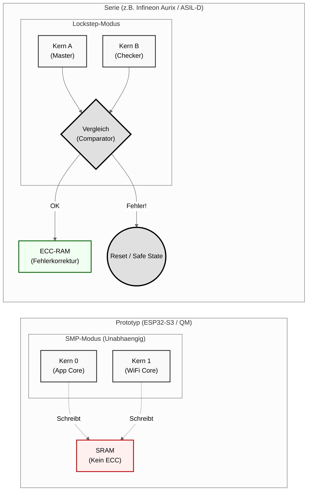

# 3. Abschlussbericht (Die kritische Distanz)

> **Zielgruppe:** Pruefer, Senior Engineers, HR
> **Zweck:** Einordnung der Leistung -- Unterschied zwischen "Basteln" und "Engineering"

---

## 3.1 Methodik

### QM-Demonstrator-Ansatz

Es wurde ein **"Quality Managed" (QM) Demonstrator** auf Basis eines ESP32-S3 entwickelt. Ziel war die Anwendung von ISO-26262-Methodiken (V-Modell, Coding Standards, Statische Analyse) auf einer COTS-Hardware-Plattform.

Der gewaehlte Ansatz trennt bewusst zwischen dem, was die Hardware leisten kann (QM-Niveau), und dem, was die Software-Prozesse bereits vorwegnehmen (ASIL-Methodik). Diese Trennung ist kein Kompromiss, sondern eine ingenieurtechnische Entscheidung: Die Software-Architektur wird so entwickelt, als waere sie fuer eine sicherheitszertifizierte Plattform bestimmt -- auch wenn die darunterliegende Hardware diese Zertifizierung nicht unterstuetzt.

### Angewandte Methodiken

**V-Modell-Anwendung:**
Das Projekt folgt dem klassischen V-Modell der Automobilindustrie. Die linke Seite (Spezifikation) umfasst Anforderungsanalyse, Systemdesign und Moduldesign. Die rechte Seite (Verifikation) spiegelt diese Ebenen durch Modul-, Integrations- und Systemtests wider. Die Implementierung bildet den Tiefpunkt des V. Jede Design-Ebene hat einen korrespondierenden Test-Level -- eine Grundvoraussetzung fuer jede ISO-26262-konforme Entwicklung.

**Coding Standards (MISRA C++ Anlehnung):**
Der Code orientiert sich an MISRA C++:2023 Richtlinien, soweit auf einer nicht-zertifizierten Toolchain praktikabel. Konkrete Massnahmen:

- Explizites Casten ungenutzter Parameter mit `(void)` (MISRA-konform)
- Vermeidung dynamischer Speicherallokation im laufenden Betrieb
- Strikte Typisierung durch `constexpr` statt `#define`
- Verwendung von `std::optional` zur erzwungenen Plausibilitaetspruefung
- `static_assert` fuer Architektur-Checks zur Kompilierzeit

**Statische Analyse:**
Die PlatformIO Build-Pipeline integriert zwei unabhaengige statische Analysewerkzeuge:

| Werkzeug | Pruefumfang | Konfiguration |
|---|---|---|
| **Cppcheck** | Portabilitaet, Performance, Style, Warnungen | `--std=c11 --std=c++17 --enable=warning,style,performance,portability` |
| **Clang-Tidy** | CERT-Regeln, Bugprone-Patterns, Security | `cert-*, clang-analyzer-*, bugprone-*, performance-*, readability-*` |

Zusaetzlich gilt die Build-Policy `-Werror`: Jede Compiler-Warnung bricht den Build ab. Dies erzwingt eine konsequente Null-Warnungen-Politik und verhindert, dass technische Schulden ueber Warnungen akkumulieren.

**ISO 26262 auf COTS-Hardware:**
Die zentrale These dieses Projekts lautet: Die Methodik ist unabhaengig von der Hardware portierbar. Der ESP32-S3 dient als kosteneffiziente Entwicklungsplattform, auf der die Software-Prozesse (Schichtenmodell, defensive Programmierung, statische Analyse) vollstaendig angewandt werden. Der Wechsel auf eine ASIL-zertifizierte MCU (z.B. Infineon Aurix, NXP S32K) wuerde lediglich den MCAL-Layer betreffen -- die Applikationslogik und der Service-Layer bleiben unveraendert.

---

## 3.2 Kritische Distanz: Prototyp vs. Serie

### Gap-Analyse

Die folgende Tabelle stellt den realisierten Prototypen dem Zielbild einer serienfaehigen ASIL-D-Entwicklung gegenueber. Diese ehrliche Analyse ist entscheidend, um die **tatsaechliche Tragweite** des Demonstrators korrekt einzuordnen.

| Kriterium | Realisierung im Projekt (ESP32) | Anforderung ISO 26262 (ASIL-D Serie) | Bewertung der Luecke |
|---|---|---|---|
| **Hardware** | ESP32-S3 (Single/Dual Core, kein Lockstep) | Infineon Aurix / NXP S32 (Lockstep Cores, ECC-RAM) | **Kritisch:** Hardware erkennt Rechenfehler nicht selbststaendig. Nur fuer QM/ASIL-A geeignet. |
| **OS / Scheduler** | FreeRTOS (Praeemptiv, generisch) | AUTOSAR OS / SAFERTOS (Zeitlich/Raeumlich partitioniert) | **Mittel:** FreeRTOS bietet keine garantierte Trennung (Memory Protection) zwischen Tasks. |
| **Fehlerbehandlung** | Software-Checks (`if`, `std::optional`) | E-Gas Monitoring (3-Ebenen-Konzept), Watchdogs | **Hoch:** Im Projekt fehlt eine unabhaengige Ueberwachungsinstanz (externer Watchdog/PMIC). |
| **Compiler** | GCC (Open Source) | Zertifizierter Compiler (z.B. Tasking, Green Hills) | **Formal:** GCC fehlt das "Tool Qualification Kit" fuer den Sicherheitsnachweis. |
| **Speicher** | SRAM ohne ECC | ECC-RAM mit Fehlerkorrektur | **Kritisch:** Bit-Flips durch kosmische Strahlung oder EMV werden nicht erkannt. |
| **Diagnose** | ESP-IDF Logging (`ESP_LOGI`) | UDS/OBD-Diagnosestack (ISO 14229) | **Hoch:** Keine standardisierte Fahrzeugdiagnose moeglich. |
| **Kommunikation** | UART/WiFi (nicht deterministisch) | CAN-FD / FlexRay (deterministisch, CRC-gesichert) | **Hoch:** Keine Echtzeitfaehigkeit auf Bus-Ebene. |

### Architekturvergleich: Prototyp (SMP) vs. Serie (Lockstep)

Das folgende Diagramm visualisiert den fundamentalen Hardware-Unterschied zwischen dem ESP32-S3-Prototyp und einer Automotive-Serien-MCU mit Lockstep-Architektur:

**Interpretation des Diagramms:**

- **Links (Prototyp):** Die beiden Kerne des ESP32-S3 arbeiten im SMP-Modus (Symmetric Multiprocessing). Beide Kerne greifen unabhaengig auf denselben SRAM zu. Es gibt **keinen Mechanismus**, der erkennt, ob ein Kern ein falsches Ergebnis berechnet hat. Ein korruptes Rechenergebnis wird direkt in den Speicher geschrieben.

- **Rechts (Serie):** In einer Lockstep-Architektur fuehren beide Kerne **identische Instruktionen** aus. Ein Hardware-Comparator vergleicht die Ergebnisse taktzyklus-genau. Bei einer Abweichung (Mismatch) wird sofort ein Trap ausgeloest, der das System in einen sicheren Zustand (Safe State) ueberfuehrt. Der ECC-RAM erkennt und korrigiert zusaetzlich Speicherfehler.

Dies ist die **fundamentale Luecke** des Prototyps: Ohne Lockstep und ECC ist eine Fehlererkennung auf Hardware-Ebene nicht moeglich. Die im Projekt implementierten Software-Checks (`std::optional`, Plausibilitaetspruefungen) koennen diese Luecke nur teilweise und nur fuer systematische Fehler kompensieren -- nicht fuer zufaellige Hardware-Fehler (Random Hardware Failures).

### Einordnung nach ASIL-Stufen

| ASIL-Stufe | Typische Funktion | Geeignete Hardware | Projektbewertung |
|---|---|---|---|
| **QM** | Infotainment, Sitzheizung | ESP32, STM32 (ohne Safety) | Voll geeignet |
| **ASIL-A** | Innenlicht, Komfortfunktionen | STM32 mit Safety-Features | Bedingt geeignet (mit Einschraenkungen) |
| **ASIL-B** | ABS, ESP | Aurix (Lockstep), S32K | Nicht geeignet (Hardware-Limit) |
| **ASIL-D** | Airbag, Lenkung, Bremse | Aurix (Lockstep + ECC + BIST) | Nicht geeignet (Hardware-Limit) |

---

## 3.3 Fazit und Ausblick

### Ergebnis

Der Einsatz von **C++17 in Kombination mit MISRA-Anlehnung** erhoet die Code-Qualitaet signifikant gegenueber klassischem C-Code auf Embedded-Systemen. Die konkreten Verbesserungen sind messbar:

- **Kompilierzeit-Absicherung:** `static_assert` und `constexpr` verlagern Fehlererkennung von der Laufzeit in die Build-Phase. Architektur-Inkompatibilitaeten werden ausgeschlossen, bevor eine einzige Zeile auf dem Target laeuft.
- **Typensicherheit:** Starke Typisierung durch C++17 eliminiert eine ganze Fehlerklasse (implizite Konvertierungen, Makro-Seiteneffekte), die in Legacy-C-Projekten haeufig zu schwer reproduzierbaren Laufzeitfehlern fuehrt.
- **Determinismus:** Feste Task-Prioritaeten, definierte Zykluszeiten (10ms), und der Verzicht auf dynamische Speicherallokation im Betrieb schaffen ein vorhersagbares Systemverhalten -- eine Grundvoraussetzung fuer jede sicherheitsrelevante Software.

### Limitation

Die ehrliche Einschraenkung: Fuer eine Serienfertigung ist ein **Hardware- und OS-Wechsel zwingend erforderlich**. Der ESP32-S3 kann die Anforderungen ab ASIL-B schlicht nicht erfuellen -- nicht wegen der Software, sondern wegen der fehlenden Hardware-Safety-Mechanismen (Lockstep, ECC, BIST). Ebenso muesste FreeRTOS durch ein zeitlich und raeumlich partitionierendes Betriebssystem (AUTOSAR OS, SAFERTOS) ersetzt werden, um die geforderte Freedom from Interference nachzuweisen.

### Portierbarkeit der Software-Architektur

Der entscheidende Mehrwert des Projekts liegt in der **Portierbarkeit des Schichtenmodells**. Die 3-Schichten-Architektur wurde exakt fuer diesen Zweck entworfen:

| Schicht | Portierungsaufwand | Begruendung |
|---|---|---|
| **Application Core** (`App_`) | Keiner | Reine C++17-Logik, keine Hardware-Abhaengigkeit. Laeuft unveraendert auf x86, ARM Cortex-R, Xtensa. |
| **Service Layer** (`Srv_`) | Minimal | Timing-Abstraktion muss an neues OS angepasst werden (z.B. `vTaskDelay` -> AUTOSAR `Schedule()`). |
| **MCAL** (`Mcal_`) | Vollstaendig | Muss komplett neu implementiert werden fuer Ziel-MCU (Register, Treiber, Peripherie). |

Diese Tabelle zeigt: Bei einem Wechsel auf eine ASIL-D-MCU bleiben zwei von drei Software-Modulen (Application Core und Service Layer, zusammen 120 von 200 Quellcodezeilen, also 60%) validiert und wiederverwendbar. Nur der MCAL und die OS-Anbindung (`main.cpp`) muessen neu implementiert werden (zusammen 80 Zeilen). Der ueberproportionale Anteil der plattformspezifischen Zeilen erklaert sich durch die umfangreiche FreeRTOS-Task-Konfiguration in `main.cpp` -- bei wachsender Applikationslogik verschiebt sich das Verhaeltnis weiter zugunsten des portablen Codes.

### Naechster Schritt: Portierung auf ASIL-D MCU

Der logische naechste Schritt ist die Portierung auf eine sicherheitszertifizierte Mikrocontroller-Plattform. Als Zielplattform bietet sich die **NXP S32K3-Familie** an:

1. **Hardware-Qualifikation:** NXP S32K3 verfuegt ueber Lockstep Cores, ECC-RAM, und ein integriertes Safety-Konzept (FCCU -- Fault Collection and Control Unit).
2. **OS-Migration:** Wechsel von FreeRTOS auf AUTOSAR OS oder SAFERTOS mit MPU-basierter Partitionierung.
3. **Compiler-Wechsel:** Migration von GCC auf einen zertifizierten Compiler (z.B. NXP GreenBox, IAR Embedded Workbench mit Safety-Zertifikat).
4. **Validierung:** Der Application Core wird auf der neuen Plattform ohne Code-Aenderungen deployed -- die erfolgreiche Kompilierung und Ausfuehrung waere der endgueltige Nachweis der Portierbarkeit.

### Schlussbewertung

Dieses Projekt demonstriert nicht das Blinken einer LED. Es demonstriert die **methodische Kompetenz**, Software nach Automotive-Standards zu entwickeln. Die Differenzierung zwischen Prototyp und Serie ist dabei kein Mangel, sondern Teil der Methodik: Wer die Grenzen seines Systems praezise benennen kann, hat das System verstanden.

> Die Hardware ist austauschbar. Die Methodik ist bleibend.

---

*Dokument erstellt im Rahmen des Automotive Software Demonstrators (QM)*
*Klassifikation: Vertraulich -- Nur fuer Pruefer und autorisiertes Personal*
