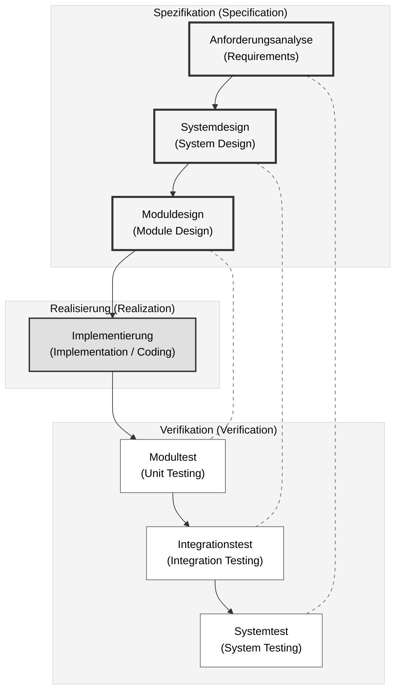
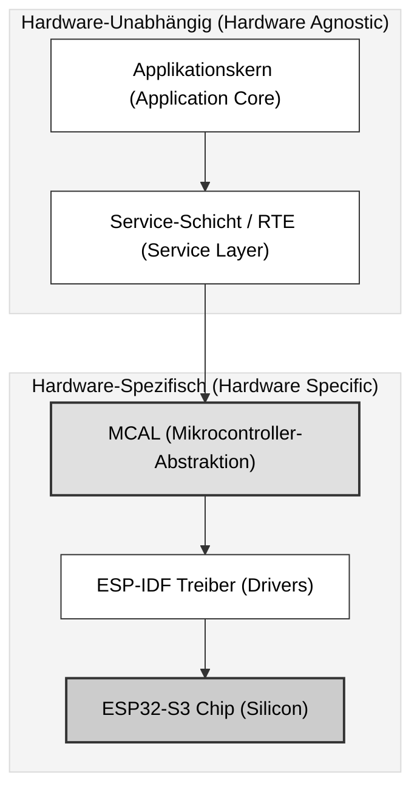
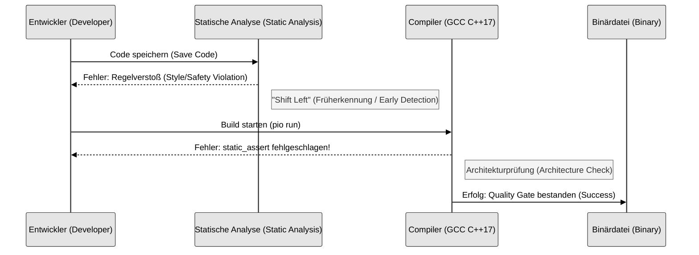
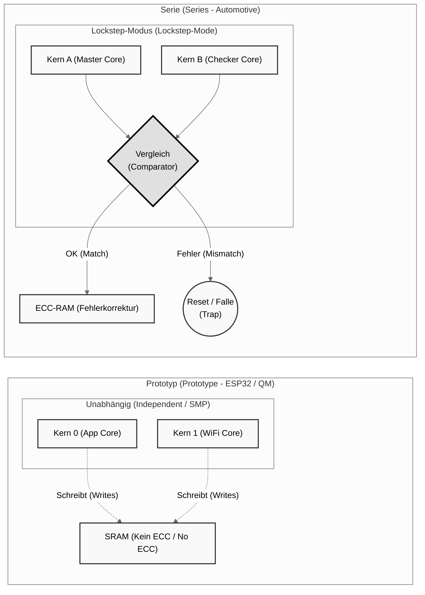

### Folie 1: Titel & Motivation

**Titel:** Automotive Software Demonstrator (QM)
**Untertitel:** Anwendung von ISO-26262-Methodiken auf COTS-Hardware (ESP32-S3)
**Name:** [Ihr Name]

**Inhalt (Bullet Points):**

* **Zielsetzung:** Entwicklung eines sicherheitsgerichteten Software-Stacks ("Quality Managed").
* **Herausforderung:** Übertragung von Automotive-Standards (MISRA, V-Modell) auf kosteneffiziente IoT-Hardware.
* **Tech Stack:**
* Hardware: Seeed Studio XIAO ESP32-S3 (Dual-Core Xtensa).
* Framework: ESP-IDF (FreeRTOS) – *No Arduino!*
* Sprache: C++17 (Application) & C11 (MCAL).


**Sprechernotiz:**

> „Guten Tag. Mein Ziel war es nicht, einfach nur eine LED blinken zu lassen. Mein Ziel war es, eine professionelle **Software-Architektur** zu implementieren, die den Prinzipien der funktionalen Sicherheit folgt – auch wenn die Hardware darunter nur ein günstiger ESP32 ist. Ich zeige hier einen 'Quality Managed' (QM) Demonstrator.“

---

### Folie 2: Die Architektur (Separation of Concerns)

**Titel:** Schichtenmodell nach V-Modell

**Visuelles Element:**





**Inhalt (Bullet Points):**

1. **Application Core (`App_`):**
* Reine C++17 Logik.
* Hardware-agnostisch (keine `esp_` Includes).
* Testbar auf x86/PC.


2. **Service Layer / RTE (`Srv_`):**
* Middleware & Timing (10ms Zyklus).
* Abstraktion von Signalen (Physik  Bits).


3. **MCAL (`Mcal_`):**
* Microcontroller Abstraction Layer.
* Kapselt ESP-IDF Treiber, GPIO, Timer.


**Sprechernotiz:**

> „Sicherheit entsteht durch Ordnung. Ich habe eine strikte **3-Schichten-Architektur** umgesetzt. Die Applikations-Logik oben weiß nicht, dass sie auf einem ESP32 läuft. Sie kennt nur Signale vom Service-Layer. Wenn wir morgen auf einen Infineon Aurix wechseln, tausche ich nur den untersten Block – den MCAL – aus. Der Rest bleibt validiert.“

---

### Folie 3: Methodik – "Shift-Left" mit C++17

**Titel:** Defensive Programmierung & Quality Gates

**Visuelles Element:**



**Inhalt (Bullet Points):**

* **Problem Legacy C:** Makros (`#define`) und rohe Pointer sind Fehlerquellen zur Laufzeit.
* **Lösung C++17:** Fehlererkennung zur **Kompilierzeit**.
* `constexpr` statt `#define` (Typsicherheit).
* `static_assert` für Architektur-Checks.
* `std::optional` erzwingt Plausibilitätsprüfung.


* **Automatisierung:**
* PlatformIO Build-Pipeline.
* Integrierte Tools: **Cppcheck** & **Clang-Tidy**.
* Policy: `-Werror` (Warnungen brechen den Build).


**Sprechernotiz:**

> „In der Serie ist ein Bug teuer. Deshalb verfolge ich den 'Shift-Left'-Ansatz. Ich nutze C++17 Features, um Fehler so früh wie möglich zu finden. Ein Beispiel: Statt zur Laufzeit zu prüfen, ob die Registerbreite stimmt, nutze ich `static_assert`. Wenn die Architektur nicht passt, kompiliert der Code gar nicht erst. Das ist Sicherheit by Design.“

---

### Folie 4: Kritische Distanz (Gap-Analyse)

**Titel:** Grenzen des Prototyps (QM vs. ASIL)

**Visuelles Element:**



**Inhalt (Tabelle):**

| Feature    | Projekt (ESP32-S3)       | Zielbild Serie (z.B. Aurix) | Bewertung                                              |
|------------|--------------------------|-----------------------------|--------------------------------------------------------|
| **CPU**    | Dual Core (SMP)          | Lockstep Cores              | **Hardware-Limit:** Keine Erkennung von Rechenfehlern. |
| **Memory** | SRAM (No ECC)            | ECC-RAM                     | **Risiko:** Bit-Flips führen zu Absturz/Fehler.        |
| **OS**     | FreeRTOS                 | AUTOSAR OS / SAFERTOS       | **Partitionierung:** Tasks sind nicht strikt getrennt. |
| **Level**  | **QM (Quality Managed)** | **ASIL-B / ASIL-D**         | Geeignet für Komfort, nicht für Bremse/Lenkung.        |

**Sprechernotiz:**

> „Ich mache mir keine Illusionen: Dies ist kein Airbag-Steuergerät. Der ESP32 hat kein Lockstep und keinen ECC-RAM. Er kann sich selbst nicht überwachen. Für eine echte ISO-26262-Zertifizierung müsste die Hardware getauscht werden. Aber: Meine **Software-Prozesse** sind bereits ASIL-ready.“

---

### Folie 5: Implementierung (Live-Einblick)

**Titel:** Code-Qualität in der Praxis

```cpp
// main.cpp - Auszug
// SAFETY: Kompilierzeit-Check der Architektur (Shift-Left)
static_assert(sizeof(void*) == 4, "Error: Target must be 32-bit");

static void run_safety_task(void* pvParameters) {
    (void)pvParameters; // Explicit ignore (MISRA Rule)
    while (true) {
        // Zyklischer Aufruf der Middleware (RTE)
        (void)Srv::Monitor::runCycle();
        // Soft Real-Time: 10ms Zyklus
        vTaskDelay(pdMS_TO_TICKS(10));
    }
}
```

**Inhalt (Bullet Points):**

* Deterministisches Task-Setup (feste Prioritäten).
* Keine dynamische Speicherallokation im laufenden Betrieb (Heap-Free).
* Strikte Typisierung und MISRA-Konformität (z.B. `void` Casts).

**Sprechernotiz:**

> „Hier sehen Sie das Ergebnis. Sauberer, deterministischer Code. Kein `malloc`, keine unklaren Makros. Der `static_assert` in Zeile 3 garantiert, dass dieser Code niemals auf einer falschen Plattform gebaut wird. Das ist der Standard, den ich liefere.“

---

### Folie 6: Fazit

**Titel:** Zusammenfassung & Ausblick

**Inhalt:**

* **Ergebnis:** Erfolgreicher Aufbau eines Automotive-QM-Demonstrators.
* **Lessons Learned:** Moderne Toolchains (PlatformIO + Linter) ermöglichen High-End-Entwicklung auch auf Low-Cost-Hardware.
* **Nächster Schritt:** Portierung des `App_Core` auf eine ASIL-D MCU (z. B. NXP S32K) zur Validierung der Portierbarkeit.

**Sprechernotiz:**

> „Zusammenfassend: Die Hardware ist austauschbar, die Methodik ist bleibend. Ich habe gezeigt, dass ich die Prozesse der Automobilindustrie verstehe und technisch umsetzen kann. Vielen Dank.“
